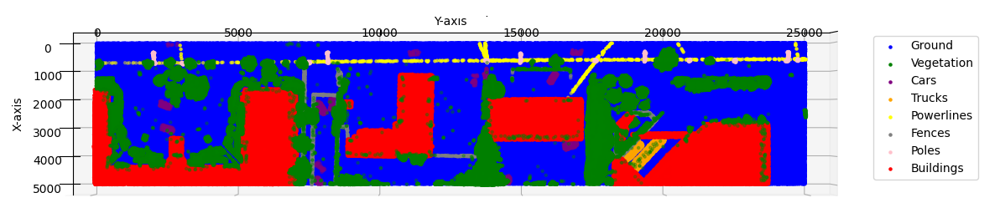
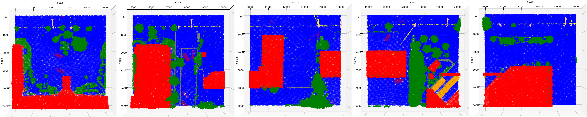
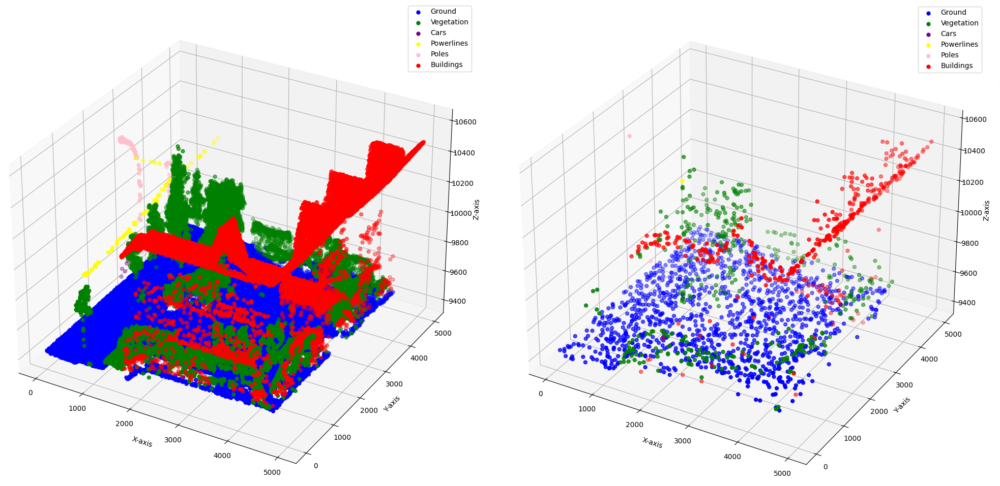
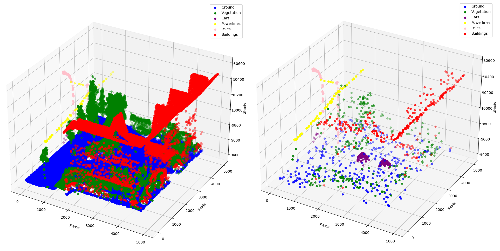
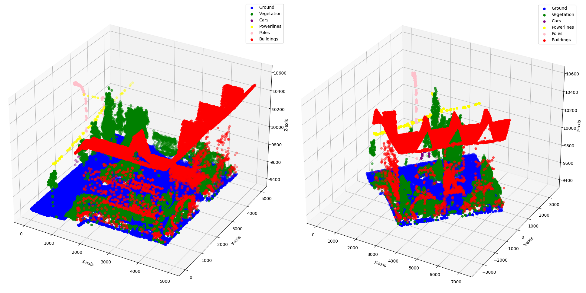

# PointNet 3D Scene Segmentation

Final project for the 2023-2024 Postgraduate course on Artificial Intelligence with Deep Learning, UPC School, authored by Paula Osés, Albert Pedraza, Laura Homet, Daniel Ochavo.

Advised by Mariona Carós.


## Table of contents

- [Overview](#overview)
  - [Project features](#project-features)
  - [More about PointNet](#more-about-pointnet)
- [DALES dataset](#dales-dataset)
  - [Downsampling](#downsampling)
    - [Random sampling](#random-sampling)
  - [Data balancing](#data-balancing)
  - [Data rotation](#data-rotation)
- [Architecture (PointNet)](#architecture-pointnet)
  - [First test with ShapeNet dataset](#first-test-with-shapenet-dataset)
  - [Layer upsize](#layer-upsize)
- [Results](#results)
  - [First approach (case study 1)](#first-approach-case-study-1)
  - [Model improvements](#model-improvements)
    - [Weighted loss](#weighted-loss)
    - [Hyperparameters](#hyperparameters)
    - [Sample rotation in batch](#sample-rotation-in-batch)
  - [Second approach (case study 2)](#second-approach-case-study-2)
  - [Third approach (case study 3)](#third-approach-case-study-3)
  - [Final results (best case)](#final-results-best-case)
- [How to](#how-to)
  - [Requirements](#requirements)
  - [Installation](#installation)
  - [How to prepare the dataset from scratch](#how-to-prepare-the-dataset-from-scratch)
    - [Download](#download)
    - [Data-preprocessing](#data-preprocessing)
  - [How to train the model](#how-to-train-the-model)
    - [Setting the environment in Google Cloud?](#setting-the-environment-in-google-cloud)
    - [Running training scripts](#running-training-scripts)
      - [Customization options](#customization-options)
      - [Visualization](#visualization)
  - [How to evaluate the model](#how-to-evaluate-the-model)
    - [Running the evaluation scripts](#running-the-evaluation-scripts)
    - [Interpreting the results](#interpreting-the-results)
- [Conclusions](#conclusions)
- [Future work](#future-work)


## Overview

Within the field of computer vision, the ability to accurately analyze 3 dimensional data stands as a cornerstone for nummerous applications, such as autonomous driving, VR or urban planning. In order to satisfy these, appears the need of efficient methods to classify and segment this data, enabling machines to understand and interact with complex 3D environments in a meaningful way.

This project makes use of the PointNet architecture, a deep neural network designed to tackle these challenges providing a direct analysis of 3D point clouds. Our implementation leverages the segmentation task of this framework and enriches it by enabling customizable parameters that will adjust the architecture to the demands of the dataset.

### Project features

- Classification and Segmentation: Support for both 3D point cloud classification and segmentation tasks.
- Weighted Loss Option: Option to use weighted loss during training to handle class imbalance.
- Custom Dataset Handling: Includes a custom dataset loader to handle 3D point cloud data efficiently.
- Visualization Tools: Functions to visualize training progress, including losses, accuracies, IoU scores, and confusion matrices.
- GPU Support: Utilizes GPU acceleration if available to speed up training and inference processes.

### More about PointNet

PointNet is a pioneering deep learning architecture for processing unstructured 3D point cloud data. It's a powerful tool for various tasks in computer vision, robotics, and augmented reality, and this repository provides an implementation tailored for 3D scene segmentation.


## DALES dataset

- [ ] **TODO:** Explicar DALES i tot el preprocessing i posar visualitzacions - LAURA

The DALES dataset is an aerial LiDAR collection featuring over half a billion hand-labeled points across 10 km2 and eight distinct object categories. Unlike other datasets, DALES focuses on aerially collected data, introducing unique challenges and opportunities for 3D urban modeling and large-scale surveillance applications. With its vast scale and high resolution, DALES provides an extensive base for evaluating and developing 3D deep learning algorithms.


Each point in this dataset has been hand-labeled under 9 different categories:

| Category | Color |
| -------- | ----- |
| Ground | 'blue' |
| Vegetation | 'dark green' |
| Power Lines | 'light green' |
| Poles | 'orange' |
| Buildings | 'red' |
| Fences | 'light blue' |
| Trucks | 'yellow' |
| Cars | 'pink' |
| Unknown | 'dark blue' |

In order to prepare the dataset for use with the PointNet architecture, we tailored a preprocessing pipeline for the DALES dataset, designed to enhance the quality and usability of the dataset, optimizing it for effective training and evaluation of our model. The key steps in this process are the following:

1. **Simplification.** We begin by simplifying the raw LAS (LiDAR Aerial Survey) files, extracting essential data such as X, Y, Z coordinates, and classification labels. This step distills the dataset down to its most important features for efficient processing.
2. **Normalization.** To ensure uniformity across the dataset, we normalize the X and Y coordinates. This involves adjusting these coordinates to a common scale by subtracting the minimum value found in the dataset, ensuring that our model trains on consistently scaled data.
3. **Subsampling.** Given the extensive size of the DALES dataset, direct processing is computationally challenging. To address this, we implement a subsampling strategy, dividing the point cloud into smaller, more manageable regions. This step allows us to maintain a high level of detail while reducing the computational load. The divider parameter controls the granularity of this subdivision, enabling flexibility in the balance between detail and performance.
4. **Balancing Classes.** Imbalances in the distribution of classes within the dataset can bias the model's training process. To mitigate this, we optionally apply a class balancing step to ensure that each class is equally represented, enhancing the model's ability to generalize across different categories.
5. **Data Augmentation - Rotation.** To improve the robustness of our model, we introduce variability into the training data through random rotations about the Z-axis. This form of data augmentation simulates a wider variety of scenarios, helping the model learn to recognize structures from different orientations.
6. **Exporting Processed Data.** After preprocessing, the data is exported into CSV files, organized by sample type (train or test) and further divided based on the subsampling strategy. This structured format makes it easy to manage and access the data during training and evaluation phases.

### Subsampling
- [ ] **TODO:** Explain






#### Random sampling
- [ ] **TODO:** Explain




### Data balancing
- [ ] **TODO:** Explain



### Data rotation
- [ ] **TODO:** Add image of balanced sample VS rotated 45 degrees VS rotated 90 degrees




## Architecture (PointNet)
PointNet is a pioneering deep neural network designed specifically for processing 3D point clouds, which are collections of data points defined in a three-dimensional coordinate system. Developed by researchers at Stanford University in 2016, PointNet stands out as the first neural network architecture to directly work with 3D point clouds, eliminating the need for pre-processing steps such as voxelization or rendering. This innovative approach enables PointNet to efficiently learn both the global and local features of point clouds, making it highly effective for a wide range of applications, including object classification, part segmentation, and scene semantic parsing.

The architecture of PointNet is ingeniously structured to cater to the unique challenges posed by point cloud data. It comprises two main components: a classification network and a segmentation network. The classification network is tasked with assigning a classification score for each of the predefined classes, enabling it to identify the type of object represented by the point cloud. On the other hand, the segmentation network combines global and local features to output per-point scores, which are essential for understanding the detailed structure of objects and their constituent parts.

Several key innovations make PointNet exceptionally effective in handling point clouds:

- **1. Spatial Transformation Network (T-Net)**: PointNet introduces a T-Net component that ensures invariance to geometric transformations. This means that the network can recognize objects regardless of their orientation, scale, or position in space, addressing a common challenge in 3D object recognition.

- **2. Permutation Invariance**: Given that point clouds are inherently unordered, PointNet leverages a symmetric function, specifically max pooling, to ensure that its output is invariant to the order of the input points. This is crucial for processing point clouds directly without needing to impose an artificial order on the data.

- **3. Local and Global Feature Aggregation**: PointNet captures the intricate details of point clouds by effectively merging local and global features. This allows the network to recognize fine-grained patterns and structures within the data, facilitating accurate segmentation and classification.

- **4. Efficiency and Scalability**: By directly processing point clouds without the need for complex pre-processing, PointNet achieves high efficiency and scalability. This makes it suitable for handling large-scale point cloud data, which is common in applications such as autonomous driving, robotics, and 3D modeling.

The complete architecture can be seen in the following image,


### First test with ShapeNet dataset
- [ ] **TODO:** Grafics de la shapenet, resultats en plots, confusion matrix, T-net
- [ ] **TODO:** Add image of ShapeNet dataset

### Layer upsize
- [ ] **TODO:** Explain potential size changes to originial PointNet

## Results - ALBERT

- [ ] **TODO:** Complete this section. Explain the training process, including hyperparameters, data augmentation techniques, and any other important details. Provide examples of how to train the model with different settings.

- [ ] **TODO:** Share the results of your experiments, including any visualizations or plots. Compare the performance of your model with state-of-the-art methods if applicable.

- [ ] **TODO:** Describe how to evaluate the model's performance on a validation or test dataset. Include metrics used for evaluation and how to interpret the results.

### First approach (case study 1)
- [ ] **TODO:** Add plots and images of first results (the one that only predicted majority classes)

### Model improvements
#### Weighted loss
- [ ] **TODO:** Add formula

#### Hyperparameters
#### Sample rotation in batch

### Second approach (case study 2)
- [ ] **TODO:** Add plots and images of the results

### Third approach (case study 3)
- [ ] **TODO:** Add plots and images of the results

### Final results (best case)
- [ ] **TODO:** Add plots and images of the results


## How to

### Requirements 
- [ ] **TODO:** Update packages + creation of venv - PAULA
- Python 3.8 or later
- PyTorch 1.7.0 or later
- Matplotlib
- Numpy
- Pandas

### Installation

1. Clone this repository to your local machine.
2. Ensure you have Python 3.8 or later installed.
3. Install the required Python packages:

```
pip install torch torchvision numpy pandas matplotlib tqdm
```

4. Navigate to the cloned repository's directory.

### How to prepare the dataset from scratch

The dataset used in the experiments includes a large-scale aerial LiDAR dataset with over a 500M hand-labeled points spanning 10 km2 of area and eight object categories, known as DALES.

#### Download

1. Download the original annotated LAS files from [this link](https://drive.google.com/file/d/1VKm05i-4fIi7xtws668LSmECbZTbvbEm/view) (~4G):

2. Place the downloaded dataset into a folder named dales_las. Inside the `dales_las` folder, ensure there are two sub-folders for train and test data:

```
dales_las/
  train/
  test/
```

#### Data-preprocessing

- [ ] **TODO:** Add preprocessing arguments - PAULA

To effectively manage a large dataset, downsampling is necessary. This project segments each sample into 100 sub-divisions using a dedicated script.

Use the `data_preprocessing.py` script for data pre-processing. Run the script by specifying the path to the dataset and the divider values.

Example command:

```
python3 data_preprocessing.py /home/dales_las 10
```

In this example, `/home/dales_las` is the path to the dataset, and 10 is the divider value.

The script divides each sample into 100 cells (10 for the x-axis and 10 for the y-axis). Subsamples will be generated in .csv format and stored in a new `data/` folder, within the `train/` and `test/` sub-folders respectively.

```
data/
  train/
    <subsample>_0.csv
    <subsample>_1.csv
    <subsample>_2.csv
  test/
    <subsample>_0.csv
    <subsample>_1.csv
    <subsample>_2.csv
```

These steps will preprocess the dataset, making it suitable for further analysis and modeling.

To visualize the subsamples, just run the `data_visualization.py` script by specifying the path to the data subsample.

Example command:

```
python3 data_visualization.py data/train/10_divisions_0.csv
```
- [ ] **TODO:** modify command 


### How to train the model

#### Setting the environment in Google Cloud?

- [ ] **TODO:** Is this needed? - DANIEL 


#### Running training scripts

To use this project for training or evaluating a PointNet model on your dataset, follow these steps:

Prepare your dataset in the required format and place it in the data directory.

Run the main script to start training or evaluation:

```
python main.py
```
- [ ] **TODO:** Add explanation of config file - PAULA

#### Customization options

You can customize the training process by modifying the following flags in main.py:

- SEGMENTATION: Set to True for segmentation tasks, or False for classification.
- WEIGHTED_LOSS: Enable or disable weighted loss calculation.
- NUM_POINTS: The number of points in each point cloud.
- NUM_CLASSES: The number of classes for classification/segmentation.

#### Visualization

After training, use the visualization functions to analyze the performance:

```
plot_losses(train_loss, test_loss)
```

- [ ] **TODO:** Add where the images are saved and which images - PAULA

### How to evaluate the model

#### Running the evaluation scripts
- [ ] **TODO:** Add trained model in drive and add in GitHub explanation in how to use it - LAURA

#### Interpreting the results

## Conclusions

- [ ] **TODO:** Complete this section - TOTS

## Future work

- [ ] **TODO:** Complete this section - TOTS


## Authors

- [laurahomet](https://github.com/laurahomet) - Laura Homet
- [albertpedra45](https://github.com/albertpedra45) - Albert Pedraza
- [paula22on](https://github.com/paula22on) - Paula Osés
- [dom27d](https://github.com/dom27d) - Daniel Ochavo
